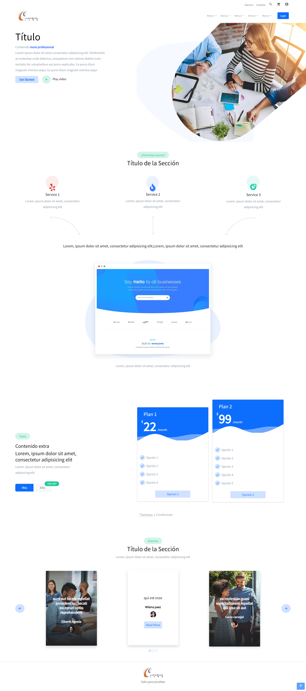
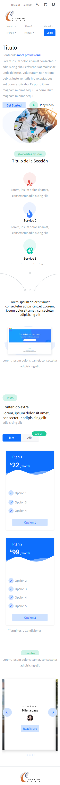

# LandingPage

## Link - GithubPages :rocket:
https://alexm9991.github.io/landing-page-angular

## Enhancements - UX:	:lipstick:

Dentro de las mejoras del prototipo de UI/UX considero que se debe definir lo siguiente:

1. Paleta de colores 
2. Márgenes o Paddings 
3. Tamaño de los elementos
4. Diseño mobile responsive
5. Diseño dark mode
6. Contenido con información real.
7. Definir el enfoque al que va referenciado esta landing page, pues no se puede determinar a simple vista si está dirigido a un nicho tecnológico, a uno educativo ó a uno de comunicación, etc.
8. Agregar un medio de contacto

## Enhancements - Code: :computer: :coffee:

1. Implementar pruebas unitarias

## Screenshot - Desktop :desktop_computer:

## Screenshot - Mobile :iphone:	

